# Agentic RAG System - Infographic Architecture

## Complete System Infographic

```mermaid
graph TB
    subgraph UserLayer["👤 USER LAYER"]
        User[User]
        Browser[Web Browser]
    end
    
    subgraph Presentation["🎨 PRESENTATION LAYER"]
        Streamlit[Streamlit UI<br/>📊 Dashboard<br/>💬 Chat Interface<br/>📄 Document Management]
    end
    
    subgraph APILayer["🌐 API LAYER"]
        FastAPI[FastAPI Server<br/>RESTful API<br/>Port: 8000]
        Routes["API Endpoints<br/>/query<br/>/health<br/>/agents<br/>/system<br/>/memory"]
    end
    
    subgraph Orchestration["🎯 ORCHESTRATION LAYER"]
        Orchestrator[Orchestrator<br/>Tier Selection<br/>Request Routing<br/>Response Aggregation]
        Config[Configuration Manager<br/>Environment Variables<br/>API Keys<br/>Settings]
    end
    
    subgraph Tier1["📚 TIER 1: BASIC RAG"]
        BasicFlow["Basic RAG Flow"]
        VS1[Vector Store<br/>ChromaDB<br/>Document Search]
        LLM1[LLM<br/>OpenAI/OpenRouter<br/>Answer Generation]
        BasicFlow --> VS1
        VS1 --> LLM1
    end
    
    subgraph Tier2["🤖 TIER 2: AGENT WITH TOOLS"]
        AgentFlow["Agent Processing Flow"]
        LocalAgent2[Local Data Agent<br/>Document Queries]
        ToolsGroup["🛠️ TOOLS"]
        Calc[Calculator<br/>Math Operations]
        WebSearch[Web Search<br/>Tavily/Serper]
        DBQuery[Database Query<br/>SQL Execution]
        Memory2[Memory System<br/>Context Retention]
        LLM2[LLM with Tools<br/>Tool Calling]
        
        AgentFlow --> LocalAgent2
        AgentFlow --> ToolsGroup
        AgentFlow --> Memory2
        ToolsGroup --> Calc
        ToolsGroup --> WebSearch
        ToolsGroup --> DBQuery
        LocalAgent2 --> LLM2
        ToolsGroup --> LLM2
        Memory2 --> LLM2
    end
    
    subgraph Tier3["🚀 TIER 3: ADVANCED AGENTIC"]
        AggFlow["Multi-Agent Flow"]
        Aggregator[Aggregator Agent<br/>Coordinator]
        
        subgraph SpecializedAgents["Specialized Agents"]
            LocalAgent3[Local Data Agent<br/>📁 Local Documents]
            SearchAgent3[Search Agent<br/>🌐 Web Search]
            CloudAgent3[Cloud Agent<br/>☁️ Cloud Storage]
        end
        
        subgraph MCPServers["MCP Servers"]
            LocalMCP[Local MCP Server<br/>Document Operations]
            SearchMCP[Search MCP Server<br/>Web Search Tools]
            CloudMCP[Cloud MCP Server<br/>Storage Operations]
        end
        
        subgraph PlanningSystem["Planning System"]
            ReAct[ReAct Planner<br/>Reasoning + Acting]
            CoT[CoT Planner<br/>Chain-of-Thought]
        end
        
        Memory3[Memory System<br/>Short & Long Term]
        Synthesis[Response Synthesis<br/>Multi-Agent Results]
        LLM3[LLM<br/>Final Answer Generation]
        
        AggFlow --> Aggregator
        Aggregator --> SpecializedAgents
        Aggregator --> MCPServers
        Aggregator --> PlanningSystem
        Aggregator --> Memory3
        SpecializedAgents --> LocalAgent3
        SpecializedAgents --> SearchAgent3
        SpecializedAgents --> CloudAgent3
        MCPServers --> LocalMCP
        MCPServers --> SearchMCP
        MCPServers --> CloudMCP
        PlanningSystem --> ReAct
        PlanningSystem --> CoT
        SpecializedAgents --> Synthesis
        MCPServers --> Synthesis
        PlanningSystem --> Synthesis
        Memory3 --> Synthesis
        Synthesis --> LLM3
    end
    
    subgraph DataLayer["💾 DATA LAYER"]
        VectorStore[Vector Store<br/>ChromaDB<br/>Persistent Storage]
        Embeddings[Embedding Generator<br/>OpenAI/OpenRouter<br/>Text Embeddings]
        Documents[Document Collection<br/>Knowledge Base<br/>Text Files]
    end
    
    subgraph MemoryLayer["🧠 MEMORY LAYER"]
        ShortTerm[Short-term Memory<br/>Conversation History<br/>Token-aware Window]
        LongTerm[Long-term Memory<br/>Semantic Search<br/>Persistent Context]
    end
    
    User --> Browser
    Browser --> Streamlit
    Streamlit --> FastAPI
    FastAPI --> Routes
    Routes --> Orchestrator
    Orchestrator --> Config
    
    Orchestrator --> Tier1
    Orchestrator --> Tier2
    Orchestrator --> Tier3
    
    Tier1 --> DataLayer
    Tier2 --> DataLayer
    Tier3 --> DataLayer
    
    Tier2 --> MemoryLayer
    Tier3 --> MemoryLayer
    
    DataLayer --> VectorStore
    DataLayer --> Embeddings
    DataLayer --> Documents
    Documents --> VectorStore
    Embeddings --> VectorStore
    
    MemoryLayer --> ShortTerm
    MemoryLayer --> LongTerm
    LongTerm --> VectorStore
    
    style UserLayer fill:#e3f2fd,stroke:#1976d2,stroke-width:3px
    style Presentation fill:#f3e5f5,stroke:#7b1fa2,stroke-width:3px
    style APILayer fill:#e8f5e9,stroke:#388e3c,stroke-width:3px
    style Orchestration fill:#fff3e0,stroke:#f57c00,stroke-width:3px
    style Tier1 fill:#e1f5ff,stroke:#0277bd,stroke-width:3px
    style Tier2 fill:#fff4e1,stroke:#ef6c00,stroke-width:3px
    style Tier3 fill:#e8f5e9,stroke:#2e7d32,stroke-width:3px
    style DataLayer fill:#fce4ec,stroke:#c2185b,stroke-width:3px
    style MemoryLayer fill:#f1f8e9,stroke:#558b2f,stroke-width:3px
```

## System Flow Infographic

## Component Stack Infographic

## Technology Stack Infographic

## Data Flow Infographic

