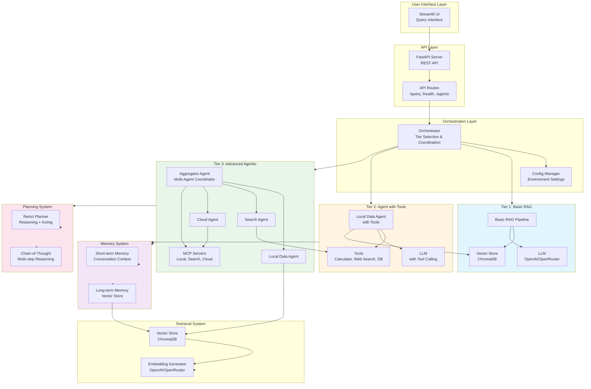
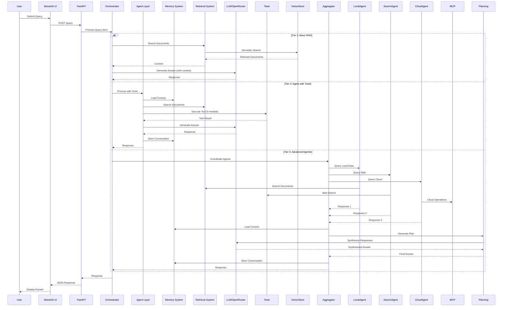
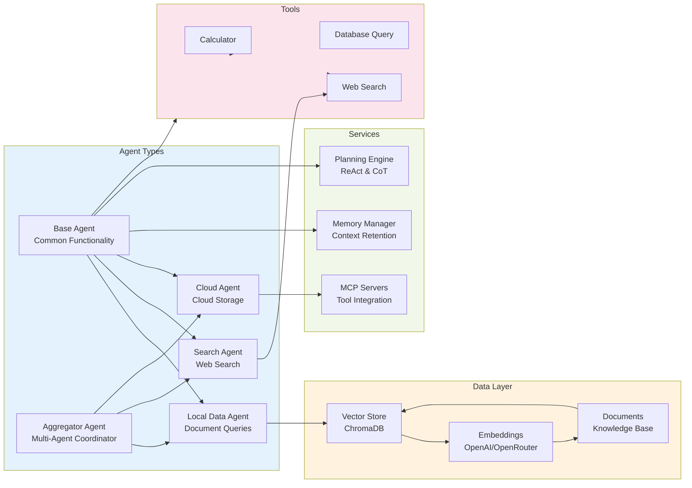
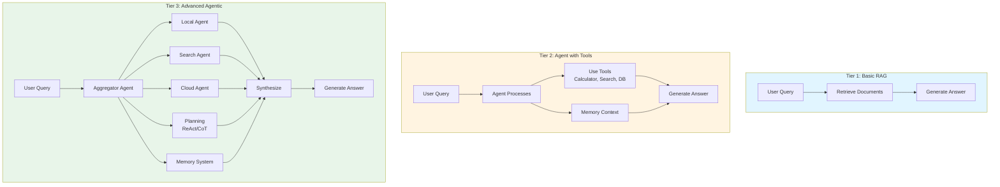

# Agentic RAG System

A production-ready Agentic Retrieval-Augmented Generation (RAG) system with multiple specialized agents, MCP servers, memory management, and planning capabilities.

## Architecture

The system implements three progressive tiers:

1. **Basic RAG**: Simple retrieval and generation pipeline
2. **AI Agent with Tools**: Agent that can use tools (calculator, web search, database)
3. **Advanced Agentic RAG**: Multi-agent system with MCP servers, memory, and planning

> 📊 **For detailed infographic diagrams, see [INFographic.md](INFographic.md)**

### System Architecture Diagram



### Data Flow Diagram



### Component Interaction Diagram



### Three-Tier Architecture Comparison



## Features

- **Multi-Agent System**: Specialized agents for local data, web search, and cloud storage
- **MCP Servers**: Model Context Protocol servers for tool integration
- **Memory Management**: Short-term and long-term memory for context retention
- **Planning Capabilities**: ReAct and Chain-of-Thought planning strategies
- **Vector Store**: ChromaDB integration for semantic search
- **REST API**: FastAPI-based API for programmatic access
- **Web UI**: Streamlit dashboard for interactive queries

## Project Structure

```
agentic-rag-system/
├── src/
│   ├── agents/          # Agent implementations
│   ├── memory/          # Memory management
│   ├── mcp/             # MCP servers
│   ├── planning/         # Planning strategies
│   ├── retrieval/        # Retrieval system
│   ├── tools/            # Agent tools
│   └── core/             # Core orchestration
├── api/                  # FastAPI application
├── ui/                   # Streamlit UI
├── tests/                # Test suite
└── data/                 # Data storage
```

## Installation

1. Clone the repository:
```bash
git clone <repository-url>
cd AgenticAI-RAG
```

2. Create a virtual environment:
```bash
python -m venv venv
source venv/bin/activate  # On Windows: venv\Scripts\activate
```

3. Install dependencies:
```bash
pip install -r requirements.txt
```

4. Set up environment variables:
```bash
cp .env.example .env
# Edit .env with your API keys and configuration
```

5. Create necessary directories:
```bash
mkdir -p data/chroma_db data/sample_documents
```

6. Add documents to the vector store (optional but recommended):
```bash
# Add sample documents
python scripts/add_documents.py --sample-docs

# Or add your own documents
python scripts/add_documents.py --file your_document.txt
python scripts/add_documents.py --directory data/sample_documents
```

## Configuration

Copy `.env.example` to `.env` and configure:

- **OpenAI/OpenRouter API Key**: Required for LLM and embeddings
  - For **OpenAI**: Leave `OPENAI_BASE_URL` empty or unset
  - For **OpenRouter**: Set `OPENAI_BASE_URL=https://openrouter.ai/api/v1` and use your OpenRouter API key
  - For OpenRouter, model names should include the provider prefix (e.g., `openai/gpt-4-turbo-preview`)
- **ChromaDB Path**: Local path for vector database
- **Web Search API**: Optional (Tavily or Serper)
- **Database URL**: Optional for database query tool
- **Cloud Storage**: Optional (AWS S3 or GCS)
- **Snowflake**: Optional for Snowflake data warehouse queries

## Usage

### Running the API Server

**Important:** The API server must be running before using the Streamlit UI.

You can run the API in several ways:

**Option 1: Using the startup script (recommended)**
```bash
./scripts/start_api.sh
```

**Option 2: From project root**
```bash
uvicorn api.main:app --reload --host 0.0.0.0 --port 8000
```

**Option 3: From api directory**
```bash
cd api
uvicorn main:app --reload --host 0.0.0.0 --port 8000
```

The API will be available at `http://localhost:8000`

### Running the Streamlit UI

**Note:** Make sure the API server is running first (see above).

**Option 1: Using the startup script (recommended)**
```bash
./scripts/start_ui.sh
```

**Option 2: Direct command**
```bash
streamlit run ui/streamlit_app.py
```

The UI will be available at `http://localhost:8501`

### Running Both Servers

You need to run both servers in separate terminal windows:

**Terminal 1 - API Server:**
```bash
./scripts/start_api.sh
```

**Terminal 2 - Streamlit UI:**
```bash
./scripts/start_ui.sh
```

### API Endpoints

- `POST /query`: Main query endpoint
  ```json
  {
    "query": "Your question here",
    "tier": "basic" | "agent" | "advanced",
    "session_id": "optional-session-id"
  }
  ```

- `GET /health`: Health check
- `GET /agents`: Agent status
- `GET /memory/{session_id}`: Get memory for session

## Development

### Running Tests

```bash
pytest tests/
```

### Adding Documents

You can add documents to the vector store in several ways:

**Option 1: Using the Streamlit UI (Easiest)**
1. Start the Streamlit UI (see above)
2. Go to the "Documents" tab
3. Use one of the following methods:
   - Click "Add Sample Documents" for quick start
   - Paste text directly and click "Add Text"
   - Upload text files (.txt, .md, .py, .json)
   - Add all files from a directory

**Option 2: Using Command Line Scripts**

```bash
# Add sample documents
python scripts/add_documents.py --sample-docs

# Add specific files
python scripts/add_documents.py --file doc1.txt doc2.txt

# Add all files from a directory
python scripts/add_documents.py --directory data/sample_documents

# Add text directly
python scripts/add_documents.py --text "Your document text here"
```

**Option 3: Programmatically**

```python
from src.retrieval.vector_store import get_vector_store

vector_store = get_vector_store()
vector_store.add_documents(
    documents=["Document text 1", "Document text 2"],
    metadatas=[{"source": "doc1"}, {"source": "doc2"}]
)
```

**Supported File Types:**
- `.txt` - Plain text files
- `.md` - Markdown files
- `.py` - Python files
- `.json` - JSON files

Large documents are automatically chunked for better retrieval.

## System Tiers

### Tier 1: Basic RAG
Simple retrieval and generation without agent capabilities.

### Tier 2: AI Agent with Tools
Single agent that can use tools (calculator, web search, database queries).

### Tier 3: Advanced Agentic RAG
Multi-agent system with:
- Specialized agents (local, search, cloud)
- MCP servers for tool integration
- Memory management (short-term and long-term)
- Planning strategies (ReAct, CoT)
- Response aggregation

## License

MIT License

## Contributing

Contributions are welcome! Please open an issue or submit a pull request.

